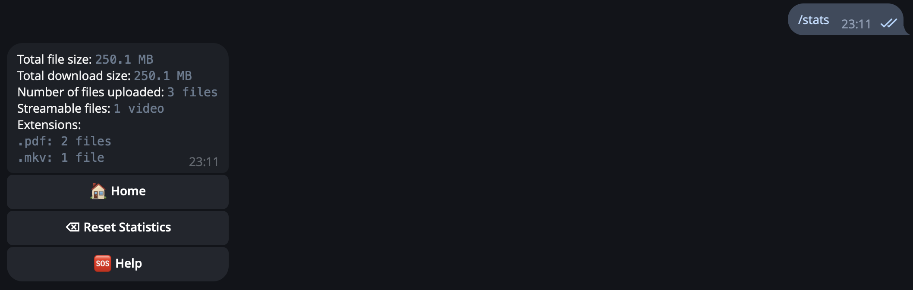
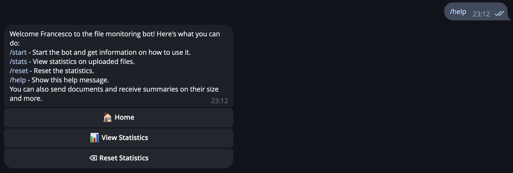

# Telegram Bot for File Statistics


This is a Telegram bot that provides statistics about files sent by users. The bot can track the total size of files, the number of files, the number of streamable files (e.g., videos), and categorize files by their extensions.

- [Telegram Bot for File Statistics](#telegram-bot-for-file-statistics)
  - [💪🏻 Features](#-features)
  - [🖼️ Preview](#️-preview)
  - [🚀 Requirements](#-requirements)
  - [🧩 Installation](#-installation)
  - [🪄 Usage](#-usage)
  - [⭐ Commands](#-commands)
  - [🗑️ Uninstall](#️-uninstall)
  - [💻 Telegram Bot API Server](#-telegram-bot-api-server)
    - [💪🏻 Features](#-features-1)
    - [📋 Prerequisites](#-prerequisites)
    - [🏁 Start the Server](#-start-the-server)
  - [🐳 Running with Docker](#-running-with-docker)
    - [📋 Prerequisites](#-prerequisites-1)
    - [🏁 Start the Project](#-start-the-project)
  - [📜 License](#-license)
  - [✨ Contributing](#-contributing)


## 💪🏻 Features

- Track total file size
- Track total download size
- Count the number of files
- Identify streamable files (e.g., videos)
- Categorize files by their extensions
- Commands to view statistics and reset data
- Localized, with support for some languages 
- Dockerized for easy deployment

## 🖼️ Preview






## 🚀 Requirements

- Python 3.12+
- [uv](https://github.com/astral-sh/uv) for dependency management

## 🧩 Installation

1. Clone the repository:
    ```sh
    git clone https://github.com/Francesco146/telegram-file-statistics-bot.git
    cd telegram-file-statistics-bot
    ```

2. Install uv if you haven't already:
    ```sh
    pip install uv
    ```

3. Create a new virtual environment using uv:
    ```sh
    uv venv
    ```
    and activate it:
    ```sh
    source .venv/bin/activate
    ```

4. Install the required packages using uv
    ```sh
    uv sync
    ```

5. Install the bot:
    ```sh
    uv run pip install .
    ```

6. Create a `.env` file in the root directory and add your Telegram bot token:
    ```env
    TELEGRAM_TOKEN='your-telegram-bot-token'
    # For local server
    TELEGRAM_API_ID='your-telegram-api-id'
    TELEGRAM_API_HASH='your-telegram-api-hash'
    # Optional
    BOT_LANGUAGE='it' # Default is english
    DEBUG_MODE='False'
    LOCAL_SERVER_MODE='False'
    DATABASE_FILE='file_statistics.db'
    ```

## 🪄 Usage

Run the bot:
```sh
telegram-file-statistics-bot [-h] [-t TOKEN] [-db DATABASE] [-d] [-v] [-l]
```

## ⭐ Commands

- `/start`: Show an home page
- `/help`: Show help message
- `/stats`: Show file statistics
- `/reset`: Reset file statistics

## 🗑️ Uninstall

To uninstall the bot, run:
```sh
uv run pip uninstall telegram-file-statistics-bot
```

## 💻 Telegram Bot API Server

This subsection sets up a local Telegram Bot API server to support bots using the official [Telegram Bot API](https://core.telegram.org/bots/api). Running a local instance adds support of archives for the main bot. This setup uses Docker to run the [aiogram/telegram-bot-api](https://hub.docker.com/r/aiogram/telegram-bot-api) image. The server will run locally on port `8081` by default and store its data in a dedicated volume.

### 💪🏻 Features

- Enables archives analysis for the main bot
- Dockerized
- Persistent data storage

### 📋 Prerequisites

- Docker and Docker Compose installed on your system
- A `.env` file in the root project directory containing your configuration (see below)

The `.env` file should be placed in the root directory. Add the following variables:

```env
TELEGRAM_API_ID='your-telegram-api-id'
TELEGRAM_API_HASH='your-telegram-api-hash'
```

### 🏁 Start the Server
Run the following command to start the Telegram Bot API server:

```bash
docker compose up telegram-bot-api
```

## 🐳 Running with Docker

This project can be run using Docker and Docker Compose. The `docker-compose.yml` file defines two services: `telegram-bot-api` and `telegram-bot`. The former is the Telegram Bot API server, while the latter is the bot itself. The bot service is configurable only through environment variables in the `.env` file.

### 📋 Prerequisites

- Docker and Docker Compose installed on your system
- A `.env` file in the root project directory containing your configuration (see below)

The `.env` file should be placed in the root directory. For more information, see the [Installation](#-installation) section.

### 🏁 Start the Project

Run the following command to start the entire project, including the Telegram Bot API server and the bot itself:

```bash
docker compose up
```
This command will start both the `telegram-bot-api` and `telegram-bot` services defined in the `docker-compose.yml` file. The bot will be accessible and ready to process files and provide statistics.

If you want to run the bot only, you can use the following command:

```bash
docker compose up telegram-bot
```

Note that, if changes are made to the bot, the image must be rebuilt using the `--build` flag:

```bash
docker compose up --build
```

## 📜 License

This project is licensed under the MIT License. See the [LICENSE](LICENSE) file for details.

## ✨ Contributing

Contributions are welcome! Please open an issue or submit a pull request for any changes. For more information, see the [CONTRIBUTING](CONTRIBUTING.md) file.
