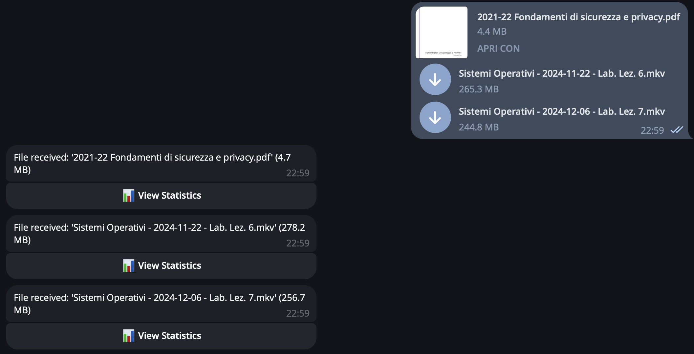

# Telegram Bot for File Statistics

This is a Telegram bot that provides statistics about files sent by users. The bot can track the total size of files, the number of files, the number of streamable files (e.g., videos), and categorize files by their extensions.

- [Telegram Bot for File Statistics](#telegram-bot-for-file-statistics)
  - [💪🏻 Features](#-features)
  - [🖼️ Preview](#️-preview)
  - [🚀 Requirements](#-requirements)
  - [🧩 Installation](#-installation)
  - [🪄 Usage](#-usage)
  - [⭐ Commands](#-commands)
  - [📜 License](#-license)
  - [✨ Contributing](#-contributing)


## 💪🏻 Features

- Track total file size
- Track total download size
- Count the number of files
- Identify streamable files (e.g., videos)
- Categorize files by their extensions
- Commands to view statistics and reset data
- Localized, with support for some languages 

## 🖼️ Preview





## 🚀 Requirements

- Python 3.10+
- [uv](https://github.com/astral-sh/uv) for dependency management

## 🧩 Installation

1. Clone the repository:
    ```sh
    git clone https://github.com/Francesco146/telegram-file-statistics-bot.git
    cd telegram-file-statistics-bot
    ```

2. Install uv if you haven't already:
    ```sh
    pip install uv
    ```

3. Create a new virtual environment using uv:
    ```sh
    uv venv
    ```
    and activate it:
    ```sh
    source .venv/bin/activate
    ```

4. Install the required packages using uv
    ```sh
    uv sync
    ```

5. Create a `.env` file in the root directory and add your Telegram bot token:
    ```env
    TELEGRAM_TOKEN='your-telegram-bot-token'
    # For local server
    TELEGRAM_API_ID='your-telegram-api-id'
    TELEGRAM_API_HASH='your-telegram-api-hash'
    # Default language is English
    LANGUAGE_BOT='it'
    ```

## 🪄 Usage

Run the bot:
```sh
uv run -m telegram-file-statistics-bot [-h] [-t TOKEN] [-db DATABASE] [-d] [-v] [-l]
```

## ⭐ Commands

- `/start`: Show an home page
- `/help`: Show help message
- `/stats`: Show file statistics
- `/reset`: Reset file statistics

## 📜 License

This project is licensed under the MIT License. See the [LICENSE](LICENSE) file for details.

## ✨ Contributing

Contributions are welcome! Please open an issue or submit a pull request for any changes.
